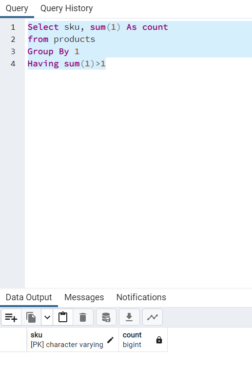
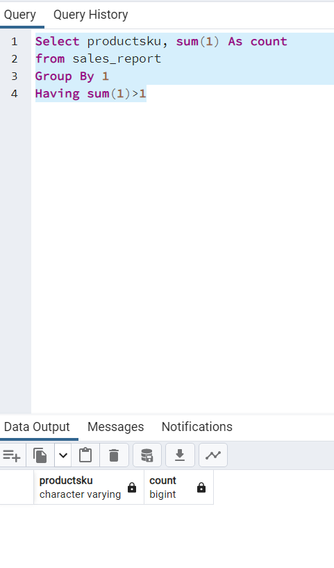
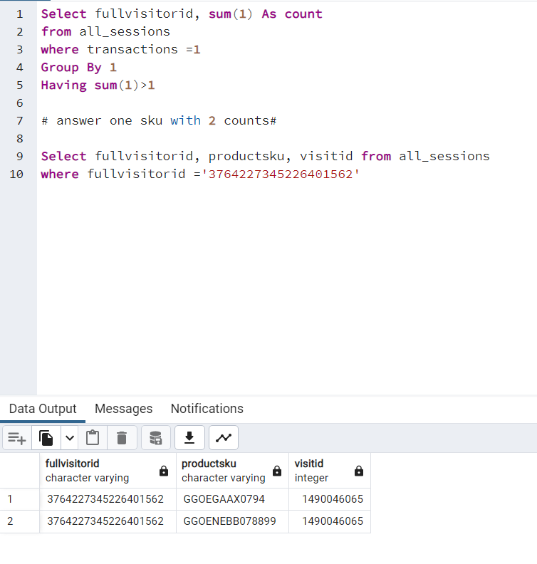
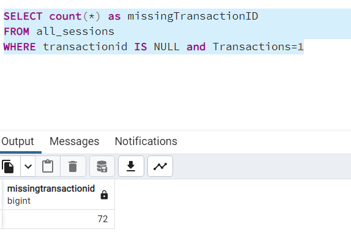
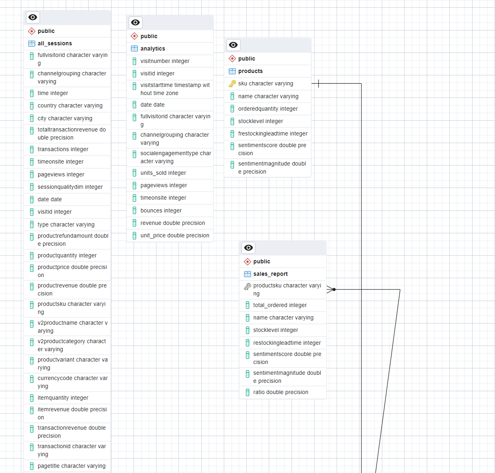

What are your risk areas? Identify and describe them.

There sre many risks:
- All sessions table doesn't have the realized revenue but potential revenue 
example refund revenue, in cart revenue...
- City with Unkonw names are not real related to a system demo
- The period of the tables are not matching
- We made the assumption that un order = one product in average to use unit_solds from analytics
- Data entry error
- wrong understanding for data field
- upolading duplicate data

QA Process:
Describe your QA process and include the SQL queries used to execute it.
THough the project, queries had for purpose to validate the reliability and accurracy of Data. 

I believe the first step here is to talk to subject matter Expert and re-assess the data, data collection and validation process and identified queries based on that.

Than rework the table All_sessions and analytics to come up with tables reflecting businness activities with primary key and establish clear relations in the ERD

Now, if  we assume that our thought process is correct among others we can develop the following queries

- Checking for unique fields
example:
QA1
Select sku, sum(1) As count
from products
Group By 1
Having sum(1)>1

No duplicate

QA2
Select sku, sum(1) As count
from sales_report
Group By 1
Having sum(1)>1
No duplicate

QA3
Select fullvisitorid, sum(1) As count
from all_sessions
where transactions =1
Group By 1
Having sum(1)>1

It shows that we have one case with same fullvisitorID and visitID and two products
therefore our assumption for question 4 is not true. We need to understand better the tables and transform them so we can derive reliable insights

- Looking for empty values example

SELECT TransactionID, “missing_TransactionID” AS reason
FROM all_sessions
WHERE TransactionID IS NULL and transactions=1

ERD picture:

