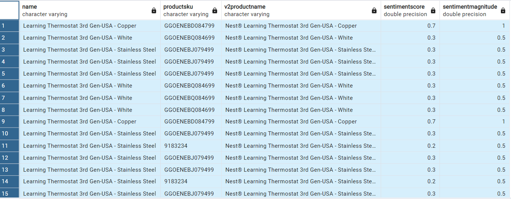

Question 1: What is the total revenues from All_sessions,
analytics and estimate revenue from sales report?

SQL Queries:
```
 #Revenue comparison between all_sessions and analytics#

Select round(cast(sum(totaltransactionrevenue)as numeric),2) as all_sessions_total_revenue from all_sessions; 
#$14281.31#

Select round (cast(sum(revenue)as numeric),2) from analytics as analytics_total_revenue from;
#Answer $1167079.98#

# we know for data cleaning 141 products from sales_report don't exist therefore we can't link them anywhere to their price by unit#

Without SME inputs, for the questions related to city/ and country I used the all_sessions table to answer questions.

```


Answer: 

Within the code

Question 2: what is the product with the highest unit solds from the sales repot? and compare to all_sessions/analytics

SQL Queries:

```
# most ordered product in quantity sold from sales report and comparison with all_sessions joined to analytics

# sales_report#
Select productsku,name,sum (total_ordered) from sales_report
group by productsku,name
order by sum (total_ordered) desc
limit 10

# all_sessions/analytics#

Select 
productsku,
v2productname,							
sum(temp.qtysold) as totalqtysold
from all_sessions a
join (
Select 
    fullvisitorid, 
    visitid, 
    SUM(units_sold) as qtysold
From 
    analytics
Where 
    revenue != 0
GROUP BY 
    fullvisitorid, visitid) temp
On  a.fullvisitorid = temp.fullvisitorid and a.visitid = temp.visitid
where transactions = 1
group by productsku,v2productname
order by sum(temp.qtysold) desc
limit 10
```
Answer:
Sales_report


All_sessions


There is definetly difference between both reports

Question 3: What are the skus # for the product in trends Nest® Learning Thermostat 3rd Gen-USA

SQL Queries:
Select name, frestockingleadtime, stocklevel, productsku,v2productname
from products
Join (
Select productsku,v2productname
from all_sessions
where v2productname like '%Nest® Learning Thermostat 3rd Gen-USA%') temp
On productsku = sku


Answer:


Some products are out of stock, further investigation required

Question 4: what is the quality measures for this product?

SQL Queries:
```
Select name, temp.productsku,v2productname, sentimentscore, sentimentmagnitude
from sales_report sr
Join (
Select productsku,v2productname
from all_sessions 
where v2productname like '%Nest® Learning Thermostat 3rd Gen-USA%') temp
On temp.productsku = sr.productsku
```
Answer:




